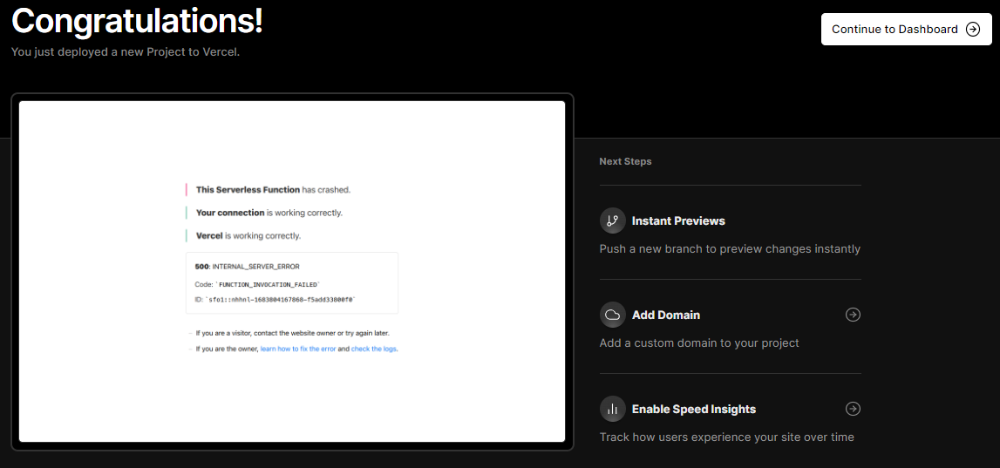

# Django + Vercel + Postgres(Beta)


[](https://django-vercel-gules.vercel.app/)

This is a template for a basic portfolio website built with Django, Vercel, and TailwindCSS. The website is hosted on Vercel, using Vercel Storage which provides Postgres for database.

## Requirements
- Python 3.11 or more
- Github Account
- Vercel Account
- Python Requirements

```ssh
asgiref==3.6.0
Django==4.2.1
psycopg2-binary==2.9.6
python-dotenv==1.0.0
sqlparse==0.4.4
tzdata==2023.3
whitenoise==6.4.0
```

## Step-by-Step Guide

### 1. Git Clone via `SSH`, `HTTP` or Download `.zip`

### 2. Add Virtual Environment

Inside Project Directory
```bash
cd django-vercel
```

Create virtual environment 
```bash
python -m venv venv-django
```

Activate Virtual environment
```bash
source venv-django/Scripts/activate
```

### 3. Install Dependency

```python
pip install -r requirements.txt
```

### 4. Add to your Github

Remove git folder
```bash
rm -rf .git
```

Add the files to the new repository and Commit
```python
git add .
git commit -m "Initial commit"
```

Set the remote URL for the new repository
```bash
git remote add origin <new_repository_url>
```

Push the files to the new repository
```bash
git push -u origin master
```

### 5. Link to VERCEL

Link the Github repo to Vercel with this configure project.

Add 5 environment variable
- `ALLOWED_HOSTS`: 127.0.0.1,.vercel.app
- `DEBUG`
- `SECRET_KEY`
- `ADMIN_PATH` (Optional if you don't want your Admin route to be `admin`)
- `POSTGRES_DB_PORT`: 5432


After Deployment it's shows Error as it fails to connect to database



Connect PostgresSQL from Vercel Storage (Beta feature)


After Successfuly connecting the Database, it will add all the environment variable related to Postgres.


### 6. Changes from Localhost

Copy all the necessary environment variable to localhost in `.env` to run migration and createsuperuser locally

```env
DEBUG='True'
SECRET_KEY='***'
ALLOWED_HOSTS='127.0.0.1,.vercel.app'
POSTGRES_DATABASE='***'
POSTGRES_USER='***'
POSTGRES_PASSWORD='***'
POSTGRES_HOST='***'
POSTGRES_DB_PORT='5432'
ADMIN_PATH='***'
```

Create superuser
```bash
py manage.py createsuperuser
```

Create Migrations
```bash
py manage.py makemigrations
py manage.py migrate
```

Collect Static
```bash
py manage.py collectstatic
```

### 7. Push to Changes to Github

```bash
git add .
git commit -m "Changes to Static Files"
git push
```

After pushing the repository, vercel will automatically deploy it!


### 8. Open your Admin


If ADMIN_PATH is set then path: `app-name.vercel.app/<ADMIN_PATH>`

Otherwise path: `app-name.vercel.app/admin`


]


## Resources and Reference
- [Tailwind Kit](https://www.tailwind-kit.com)
- [Flowbite](https://flowbite.com/)
- [Unsplash](https://unsplash.com/)
- [XSGames: Random User Image Generator](https://xsgames.co/randomusers/)

## Contributing
If you'd like to contribute to this template, please open an issue or submit a pull request.

If you encounter any issues with Python version or operating system compatibility, please feel free to contribute to the repository by submitting an issue or pull request. We welcome all contributions to make this template more accessible to developers on different platforms.

## License
This project is licensed under the MIT License - see the [LICENSE](./LICENSE) file for details.