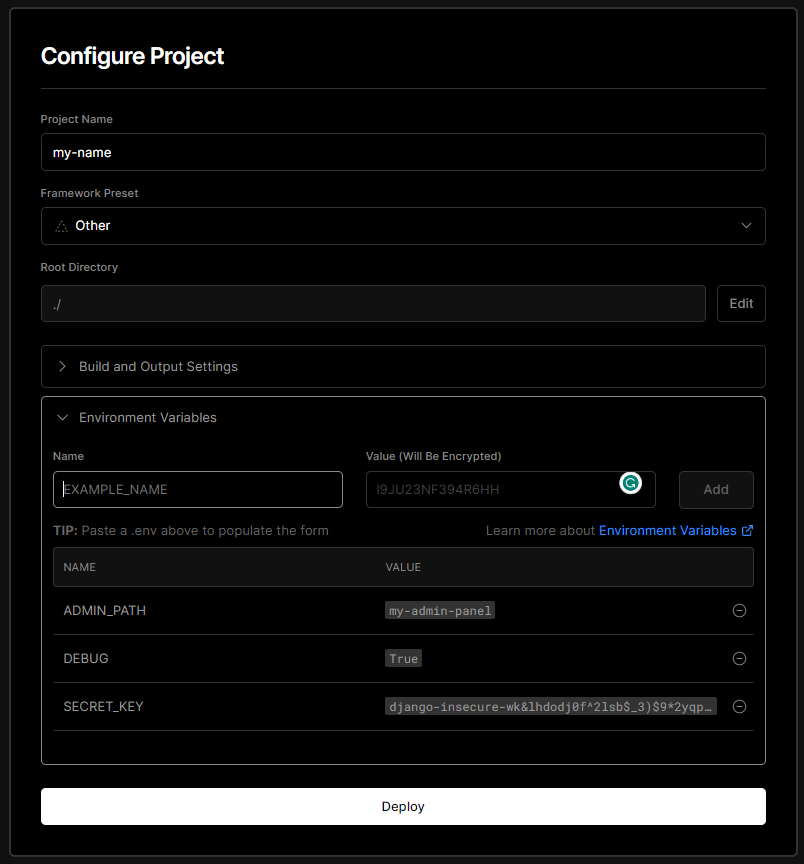
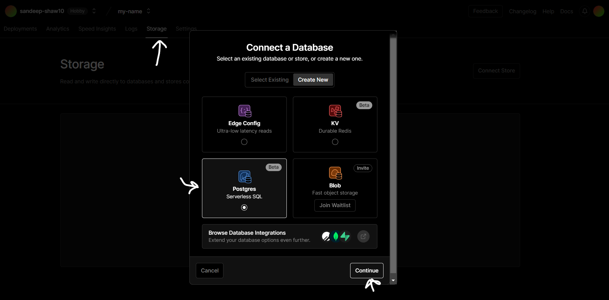
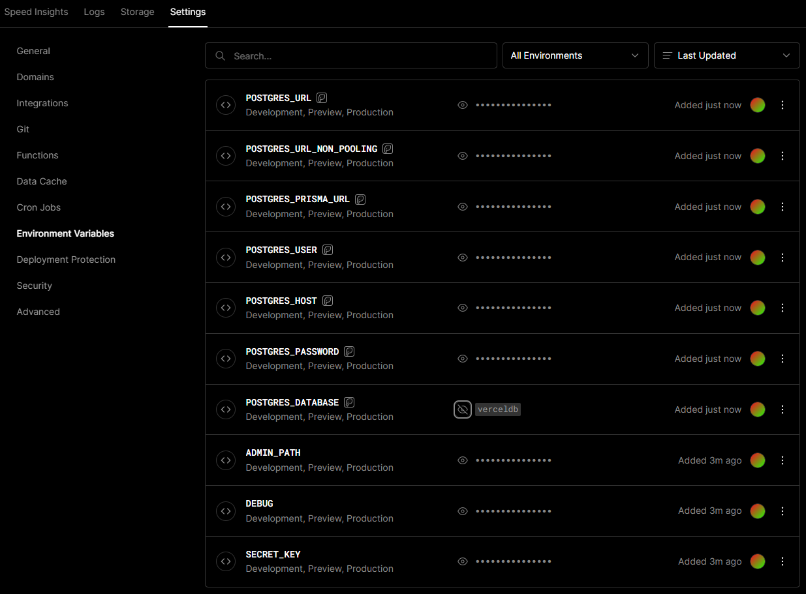
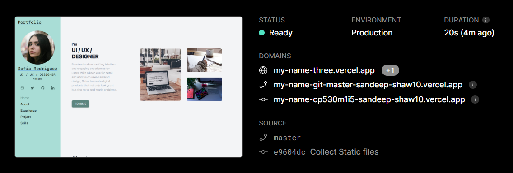
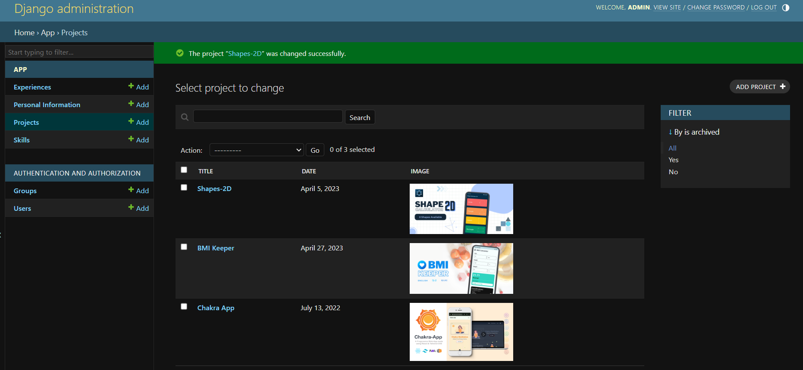

# Django + Vercel + Postgres(Beta)


[](https://django-vercel-gules.vercel.app/)

This is a template for a basic portfolio website built with Django, Vercel, and TailwindCSS. The website is hosted on Vercel, using Vercel Storage which provides Postgres for database.

## Requirements
- Python 3.11 or more
- Github Account
- Vercel Account
- Python Requirements

[requirements.txt](./requirements.txt)
```ssh
asgiref==3.6.0
Django==4.2.1
psycopg2-binary==2.9.6
python-dotenv==1.0.0
sqlparse==0.4.4
tzdata==2023.3
whitenoise==6.4.0
```

# Installation and Setup


## 1. Git Clone via `SSH`, `HTTP` or Download `.zip`

```bash
git clone https://github.com/sandeep-shaw10/django-vercel.git
```

## 2. Creating and Activating Virtual Environment

Inside Project Directory
```bash
cd django-vercel
```

Create virtual environment 
```bash
python -m venv venv-django
```

Activate Virtual environment
```bash
source venv-django/Scripts/activate
```

## 3. Install Python Dependency

```python
pip install -r requirements.txt
```

## 4. Create `.env` file

Create a `.env` file in the template folder. You may copy it from [.env.example](.env.example)

```bash
DEBUG='False'
SECRET_KEY='django-key-should-be-strong-^28%=s79k2icoihozrx-cx'
ALLOWED_HOSTS='127.0.0.1,.vercel.app'
POSTGRES_DATABASE='***'
POSTGRES_USER='***'
POSTGRES_PASSWORD='***'
POSTGRES_HOST='***'
POSTGRES_DB_PORT='5432'
ADMIN_PATH='my-admin'
```

## 5. Add to your Github

Login to your Github Account and Create New Repository

Inside your local folder remove git folder if it exists

```bash
rm -rf .git
```

Add the files to the new repository and Commit
```python
git init
git add .
git commit -m "Initial commit"
```

Set the remote URL for the new repository
```bash
git remote add origin <new_repository_url>
```

Push the files to the new repository to branch 'master'
```bash
git push -u origin master
```

## 6. Link to VERCEL

Login to the vercel account and create NEW project


Link the Github repository that you currently created to Vercel
- Framework Present: `Other`
- Root Directory: `./`
- No need to configure Build and Output setting

**Add Only these 5 environment variable (IMPORTANT)**
- `ALLOWED_HOSTS`: 127.0.0.1,.vercel.app
- `DEBUG`: False
- `SECRET_KEY`: (Add strong Django SECRET Key, Should be same as the local file)
- `ADMIN_PATH` (Optional if you don't want your Admin route to be `admin`)
- `POSTGRES_DB_PORT`: 5432



Connect PostgresSQL from Vercel Storage (Beta feature), if database exist or else create new PostgresSQL


After Successfuly connecting the Database, it will add all the environment variable related to Postgres.



## 6. Changes from Local Device

Copy all the necessary environment variable to localhost in `.env`. Moreover the environment variable in localhost and in Vercel should be same.

This will allow us to perform migrations and create superuser for local device.

Only copy 4 postgres environment variable to local. Rest of it is not required
- POSTGRES_DATABASE
- POSTGRES_USER
- POSTGRES_HOST
- POSTGRES_PASSWORD

The resulting `.env` file in the local device will look like this
```env
DEBUG='True'
SECRET_KEY='django-key-should-be-strong-^28%=s79k2icoihozrx-cx'
ALLOWED_HOSTS='127.0.0.1,.vercel.app'
POSTGRES_DATABASE='***'
POSTGRES_USER='***'
POSTGRES_PASSWORD='***'
POSTGRES_HOST='***'
POSTGRES_DB_PORT='5432'
ADMIN_PATH='my-admin'
```

Start the local server again to load the current change in environment variable

```bash
py manage.py runserver
```

Create superuser
```bash
py manage.py createsuperuser
```

Issue: [Git Bash: Superuser creation skipped due to not running in a TTY](https://stackoverflow.com/questions/32532900/not-able-to-create-super-user-with-django-manage-py#answer-37093626)

Create Migrations
```bash
py manage.py makemigrations
py manage.py migrate
```

## 7. Redeploy Vercel Project

As all the environment varible is now available, migration done and superuser is created. Now we can re-deploy the application without any error




## 8. Open your Admin


If ADMIN_PATH is set then path: `<app-name>/<ADMIN_PATH>`

Otherwise path: `<app-name>/admin`



## 9. Configuration

Change Admin Heading: [core/urls.py](./core/urls.py)

```py
# Admin Display
admin.site.site_header = 'My Name'         
admin.site.index_title = 'Portfolio'
admin.site.site_title = 'Sandeep Shaw' 
```

Change HTML Pages: [templates/](./templates/)

Scope for Adding images, css, js: [assets/](./assets/)

After adding any static file, run the collectstatic command which will create folder: [static/](./static/)
```bash
py manage.py collectstatic
```

Changing the Theme Color: [templates/base.html](./templates/base.html)

```html
    <script src="https://cdn.tailwindcss.com"></script>
    <script>
        // Scope to format color
        tailwind.config = {
            theme: {
                extend: { 
                    colors: {
                        'shaw': {
                            0: '#e2f3f1',
                            100: '#c6e8e4',
                            200: '#a9ddd6',
                            300: '#96c7c1',
                            400: '#83b1ab',
                            500: '#5d857f',
                            600: '#375954',
                            700: '#24433e',
                            800: '#1b3833',
                            900: '#112c28',
                            999: '#061714'
                        },
                    }
                }
            },
        }
    </script>
```

Custom 404 Error Page: [templates/404.html](./templates/404.html)

Custom 500 Error Page: [templates/500.html](./templates/500.html)

## Step-by-Step Video Tutorial

[](https://www.youtube.com/watch?v=erLOWlo6nGA)


## Resources and Reference
- [Tailwind Kit](https://www.tailwind-kit.com)
- [Flowbite](https://flowbite.com/)
- [Unsplash](https://unsplash.com/)
- [XSGames: Random User Image Generator](https://xsgames.co/randomusers/)

## Contributing
If you'd like to contribute to this template, please open an issue or submit a pull request.

If you encounter any issues with Python version or operating system compatibility, please feel free to contribute to the repository by submitting an issue or pull request. We welcome all contributions to make this template more accessible to developers on different platforms.

## License
This project is licensed under the MIT License - see the [LICENSE](./LICENSE) file for details.